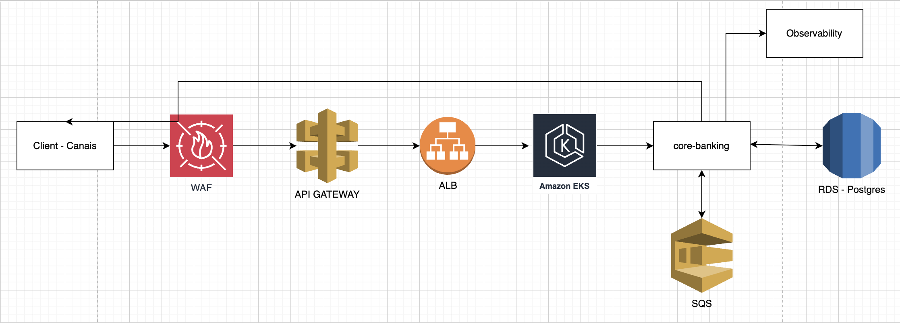

# Core Banking - Transaction Service

## Overview

This project implements a transaction processing service for a banking system, supporting credit and debit operations with guarantees of:

- Consistency
- Idempotency
- Concurrency safety

The system was designed considering a high-throughput and mission-critical scenario, focusing on scalability, availability, resilience, and observability.

---

## Technologies

- Kotlin + Quarkus
- PostgreSQL
- Hibernate ORM + Panache
- AWS SQS (LocalStack for local development)
- OpenTelemetry (Tracing)
- JUnit 5 + Mockito
- Docker / Docker Compose

---

## Architecture Overview

Layered architecture:

- Controller → HTTP entry
- Service → business logic
- Repository → persistence
- SQS Consumer → async ingestion

### Flow

1. Receive request
2. Validate
3. Check idempotency
4. Lock account (pessimistic)
5. Update balance
6. Persist transaction
7. Return response

---

## Cloud Architecture (Proposal)



---

## Design Decisions & Tradeoffs

### PostgreSQL
- Strong consistency (ACID)
- Tradeoff: less horizontal scaling vs NoSQL

### Pessimistic Lock
- Prevents race condition
- Tradeoff: reduces throughput under contention

### Idempotency
- Idempotency-Key + request hash
- Prevents duplicate processing
- Tradeoff: extra storage/computation

### SQS
- Decoupling and resilience
- Tradeoff: eventual consistency

---

## Idempotency

| Scenario | Result |
|--------|--------|
| Same key + same payload | Replay |
| Same key + different payload | 409 |
| New key | Process |

---

## Scalability

- Stateless app
- Horizontal scaling
- Queue-based ingestion

---

## Resilience

### Implemented
- Idempotency
- Safe SQS consumption
- Transactional DB
- Locking
- DLQ

### Future
- Retry (backoff + jitter)
- Circuit breaker

---

## Observability

- OpenTelemetry tracing enabled
- CorrelationId
- Logs
- Structured logging with correlation data (correlationId, idempotencyKey, transaction details)
- Correlation ID propagation across layers
- OpenTelemetry tracing with custom span (transaction.transfer)
- Business attributes captured in spans (account, amount, status, etc.)
- Error tracking via recordException and span status

### Distributed Tracing
•	OTLP exporter configured
•	Jaeger integrated via Docker Compose
•	Traces can be visualized at:
•	http://localhost:16686

### Future Metrics
- TPS
- Latency
- Error rate
- OpenTelemetry Collector for advanced pipeline
- Metrics (Micrometer + Prometheus/Grafana or CloudWatch)
- Centralized logging (ELK or CloudWatch)

---

## Tests

- Unit tests
- Integration tests
- Load test (JMeter)

## Performance Testing (JMeter)

Performance tests were executed using Apache JMeter to validate system behavior under load.

### Scenario

- Concurrent users: configurable
- Operations: CREDIT / DEBIT
- Idempotency enabled
- Database: PostgreSQL

### Files

Performance test files are available in:

- /performance/jmeter
  - run the command on database: ```SELECT id, ('CREDIT' or 'DEBIT'), value(100, 200, etc), 'BRL' FROM account;```
  - export data on file CSV and use in JMETER
- /performance/postman
  - import the collection on postman

---

## Running locally

Start dependencies:

```bash
docker compose up -d

./mvnw quarkus:dev
./mvnw clean test
```

---

## CI/CD

- Build
- Tests
- Docker
- Deploy

---

## Future Improvements

- Retry strategies
- Circuit breaker
- Metrics (Prometheus)
- Ledger model

---

## Notes

Production-ready mindset with focus on consistency, performance and resilience.
